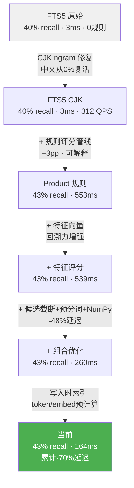

# 记忆花园 Memory Garden

[](https://github.com/Yaoniguan-Money/memory-garden/actions/workflows/tests.yml)


记忆花园 Memory Garden is a local-first, auditable memory layer for AI agents, also usable as a memory skill in agent hosts.

It helps agents resist long-context attention dilution and context-window forgetting at the application layer. Instead of stuffing more raw history into the prompt, it retrieves the right local memory before each reply and injects a compact, traceable brief. You can adopt it as a Python package, wire it into an agent runtime, or expose it as a memory skill. The default path is rules-only and makes no network calls. Optional LLM providers are caller-owned and explicit.

[中文说明](README_中文.md) | [Docs](docs/index.md) | [Quickstart](docs/quickstart.md)

Public naming stays consistent:

- Project display name: `记忆花园 Memory Garden`
- Package name: `memory-garden`
- Python import: `memory_garden`
- Main class: `MemoryGarden`

## 检索性能

在 `medium` 数据集（500 条中英混合记忆、20 条查询、90% 噪声、纯 CPU）上的基准结果。完整报告见 [docs/reports/retrieval_benchmark_v2.md](docs/reports/retrieval_benchmark_v2.md)。

| 指标 | FTS5 (CJK ngram) | Product 规则 | + 本地嵌入 |
|------|------------------|-------------|-----------|
| Recall@5 | 40.0% | 43.3% | 43.3% |
| NDCG@5 | 0.41 | 0.45 | 0.46 |
| Hit@5 | 85.0% | 90.0% | 90.0% |
| MRR | 0.71 | 0.78 | 0.79 |
| P50 延迟 | 3.2ms | 164ms | 282ms |
| P95 延迟 | 4.2ms | 199ms | 327ms |
| QPS | 297.1 | 6.4 | 3.8 |

> **本地嵌入**: `bge-small-zh-v1.5`（24MB），纯 CPU，无需 GPU/API Key/联网。冷启动约 14 秒（首次预热全库向量 + 检索索引），之后查询延迟仅比纯规则多 118ms（164→282ms）。嵌入在排序质量上有增益（NDCG +0.01, MRR +0.01），在真实场景的语义理解（同义词、改写、跨语言）中价值更大。
>
> 运行基准：`pip install "memory-garden[embeddings]" && python -m benchmarks.retrieval --dataset medium --baselines default --output docs/reports/benchmark_v2.json`
>
> 检索策略可通过 `GardenRuntimeConfig.retrieval.strategy` 配置：`fts_only`（纯全文，最快）、`fts_with_vector_rescore`（默认，平衡）、`full_hybrid`（全量向量召回，最慢但覆盖面最大）。

### 优化路径（Ablations）



### 延迟分布


### 行业对比（同数据、同查询）

在 `medium` 数据集上与 ChromaDB（默认 `all-MiniLM-L6-v2`）和 FAISS Flat（`bge-small-zh-v1.5`）同条件对比。完整 JSON 见 [docs/reports/comparison_benchmark.json](docs/reports/comparison_benchmark.json)。

| 系统 | Recall@5 | NDCG@5 | P50 | P95 | 内存 | 依赖数 | 网络调用 | CO₂ |
|------|----------|--------|-----|-----|------|--------|---------|-----|
| Memory Garden FTS5 | 40.0% | 0.415 | 3.1ms | 3.8ms | 432MB | 2 | 0 | 0 |
| Memory Garden Product | 43.3% | 0.454 | 175.8ms | 190.2ms | 434MB | 2 | 0 | 0 |
| ChromaDB | 33.3% | 0.372 | 176.8ms | 184.5ms | 506MB | 134 | 0 | 0 |
| FAISS Flat | 28.3% | 0.340 | 6.9ms | 7.4ms | 663MB | 134 | 0 | 0 |

运行：`pip install "memory-garden[bench,embeddings]" && python -m benchmarks.comparison --dataset medium --output docs/reports/comparison_benchmark.json --markdown docs/reports/comparison_benchmark.md`

## 为什么选择 Memory Garden

| 特性 | Memory Garden | LangChain Memory | Mem0 | ChromaDB |
|------|-------------|-----------------|------|---------|
| 无外部 API 依赖（默认） | ✅ | ✅ | ❌ | ✅ |
| 规则可解释 | ✅ | ❌ | ❌ | ❌ |
| 遗忘证明 | ✅ | ❌ | ❌ | ❌ |
| 本地嵌入可选（无联网） | ✅ | 部分 | ❌ | ✅ |
| 中文原生 FTS/CJK | ✅ | ❌ | 部分 | ❌ |
| 核心运行时依赖 | 2 | 50+ | 30+ | 15+ |

## Why Memory Garden

An agent can chat with you for 50 turns and still forget that you prefer short Chinese replies with English technical terms. Plain vector recall can retrieve similar text, but it often lacks provenance, deletion proof, and policy boundaries.

Memory Garden does not claim to modify a Transformer's internal attention mechanism. It mitigates the practical symptom of attention drop in long conversations by selecting durable, relevant memory outside the live context window and reintroducing it only when needed. The core is a memory layer; the skill form is one delivery surface for that capability.

Memory Garden treats memory as a lifecycle:

```text
User message -> Seed -> Court -> Growth -> Dream -> Harvest -> Brief -> Agent
```

Every long-term memory is traceable to source ids. Content that cannot be traced does not enter durable memory.

## Quickstart

```bash
pip install memory-garden
memory-garden demo
memory-garden health
```

For optional LLM assistance, prefer environment variables:

```bash
export DEEPSEEK_API_KEY="..."
```

```python
from memory_garden.sdk import MemoryGarden

garden = MemoryGarden.local("./my_garden")
skill = garden.as_skill().with_deepseek()
```

Claude Code hook usage:

```bash
python -m memory_garden.integrations.adapters.claude_code before
python -m memory_garden.integrations.adapters.claude_code after
```

Adapter CLIs stay rules-only by default. If you explicitly want them to auto-load
provider credentials from environment variables or local `provider_config.json`,
set `MEMORY_GARDEN_ENABLE_PROVIDER_AUTOLOAD=1` for that session.

## Integration

Claude Code:

```python
from memory_garden.sdk import MemoryGarden
from memory_garden.integrations.adapters.claude_code import ClaudeCodeSession

garden = MemoryGarden.local("./my_garden")
session = ClaudeCodeSession(garden=garden)
context = session.before(user_message="How should I reply?")
session.after(assistant_reply="...")
session.close()
```

Custom agent via skill API:

```python
skill = garden.as_skill()
ctx = skill.before("I prefer short replies.")
reply = call_your_model(ctx.brief_text)
skill.after("I prefer short replies.", reply)
```

## Session commands

- `花花开` (Hua Hua Kai) opens a garden session and begins harvesting memory.
- `花花关` (Hua Hua Guan) closes the session and emits structured feedback.

Control commands are never stored as user memory.

## Effect

Older rule-only briefs expose source identifiers in the human-facing text:

```text
[use] If relevant, reference memory ids: id1, id2, id3, id4.
```

With an LLM brief writer configured, the hook injects a natural-language summary while retaining source ids internally:

```text
[use] The user prefers short replies in Chinese, with technical terms kept in English. They mainly use VS Code and Go/Rust for backend work.
```

## Architecture

```text
Core       Seed, Court, Growth, Dream, Harvest, Brief
Covenant   Policy, trust rules, visibility boundaries
Harvest    Local retrieval, ranking, and source-preserving briefs
Cognition  Optional LLM enhancement for harvest-time writing and ranking
Product    Proposal review, versioning, retrieval, forget proof
Soil       Local home, SQLite storage, FTS index, health checks
Adapters   Claude Code, Codex, Hermes, OpenAI/Anthropic, LangChain, LangGraph, FastAPI, LlamaIndex
```

The default rules-only behavior remains stable. LLM output is validated with Pydantic and must carry traceable `source_ids`, `memory_ids`, or `seed_ids`.

## Tech Stack

Memory Garden is intentionally small at runtime and explicit at integration boundaries:

| Area | Technologies |
|---|---|
| Language & packaging | Python 3.10+, setuptools, PEP 621 `pyproject.toml`, optional dependency extras |
| Data modeling | Pydantic v2 models, typed dataclasses, schema validation for LLM output |
| Config & policy | PyYAML, local policy files, `ProviderPolicy`, `ProviderRegistry` |
| Persistence | SQLite, JSON payload columns, local garden home layout, manifest files |
| Search & retrieval | SQLite FTS5, deterministic rule scoring, keyword scoring, source-preserving ranking |
| LLM integration | OpenAI-compatible provider interface, DeepSeek provider, optional embedding/reranker providers |
| Agent/framework adapters | Claude Code hooks, Codex CLI/session wrapper, Hermes hooks, OpenAI SDK wrapper, Anthropic SDK wrapper, LangChain, LangGraph, FastAPI, LlamaIndex |
| Safety & audit | Source-id traceability, Pydantic validation, hard forget proof, SQL table allowlists, local-first defaults |
| Testing & CI | pytest, deterministic fake providers, GitHub Actions matrix for Python 3.10/3.11/3.12 |
| Security tooling | `detect-secrets`, `.secrets.baseline`, `.gitignore` protection for local DBs and provider configs |

Notably absent by default: no vector database, no background service, no mandatory cloud API, and no heavy framework dependency in the core package.

## Integration

Claude Code:

```python
from memory_garden.sdk import MemoryGarden
from memory_garden.integrations.adapters.claude_code import ClaudeCodeSession

garden = MemoryGarden.local("./my_garden")
session = ClaudeCodeSession(garden=garden)
context = session.before(user_message="How should I reply?")
session.after(assistant_reply="...")
session.close()
```

Custom agent:

```python
skill = garden.as_skill()
ctx = skill.before("I prefer concise replies.")
reply = call_your_model(ctx.brief_text)
skill.after("I prefer concise replies.", reply)
```

## Security

- Local-first by default: no cloud sync, no background network calls.
- Optional model providers require explicit configuration.
- API keys should come from environment variables; `provider_config.json` is only a local fallback.
- Adapter hook CLIs do not auto-load remote providers unless you explicitly opt in with `MEMORY_GARDEN_ENABLE_PROVIDER_AUTOLOAD=1`.
- SQLite data is plaintext on disk, so do not commit garden homes or database files.
- Dynamic SQL identifiers are constrained by allowlists:
  `memory_garden.product.storage._MODEL_TABLES = {"memory_proposals", "forget_plans"}` and
  `memory_garden.storage.sqlite_support.ALLOWED_TABLES = {"seeds", "memory_cards", "court_cases", "dream_records", "compost_records", "greenhouse_records", "pruning_records", "garden_events"}`.
- Hard forget removes active memory and related FTS entries, then records proof.

Important ignored files:

```text
.memory_garden/
*.db
*.db-wal
*.db-shm
*_state.json
provider_config.json
```

## Development

```bash
pip install -e ".[dev]"
python -m pytest
memory-garden doctor --path ./my_garden
```

Release gate: the full test suite must pass on a clean checkout.

Before making a repository public, verify no sensitive files ever entered Git history:

```bash
git log --all --full-history -- "*.db" "*.key" "*_state.json" "provider_config.json"
```

If sensitive files appear, scrub history before going public.

## License

MIT. See [LICENSE](LICENSE).
