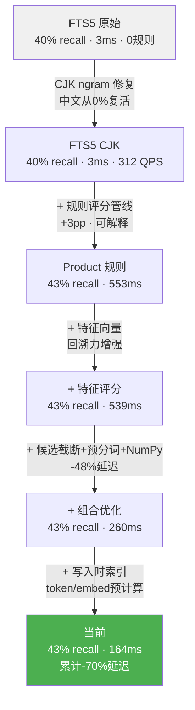

# 记忆花园 Memory Garden

[](https://github.com/Yaoniguan-Money/memory-garden/actions/workflows/tests.yml)


记忆花园 Memory Garden 是一个面向 AI Agent 的 local-first、可审计记忆层，也可以作为记忆 Skill 接入不同的 agent host。

它在应用层缓解长上下文里的注意力稀释和上下文遗忘问题。它不会把更多原始历史粗暴塞回 prompt，而是在 Agent 回复前取回真正相关的本地记忆，并注入一段紧凑、可追溯的 brief。你既可以把它当作 Python 包集成到系统里，也可以把它作为记忆 Skill 暴露给上层 agent。默认路径是 rules-only，不发起网络请求；可选的 LLM provider 必须由调用方显式配置。

[English README](README.md) | [文档](docs/index.md) | [快速开始](docs/quickstart.md)

对外名称统一如下：

- 项目展示名：`记忆花园 Memory Garden`
- 包名：`memory-garden`
- Python 导入名：`memory_garden`
- 主要类名：`MemoryGarden`

## 为什么需要它

一个 Agent 就算已经和你聊了很多轮，也仍然可能忘记你偏好简短中文回复、技术术语保留英文，或者忘记哪些偏好已经失效。普通向量召回能找到相似文本，但往往缺少来源、删除证明和明确的策略边界。

记忆花园并不声称修改了 Transformer 内部的注意力机制。它缓解的是长对话里的实际症状：当实时上下文窗口开始稀释重点时，把窗口外但仍然重要、而且可追溯的长期记忆重新带回当前回复流程。它的本体是记忆层，Skill 只是这种能力的一种交付形态。

记忆花园把记忆当作一条生命周期处理：

```text
User message -> Seed -> Court -> Growth -> Dream -> Harvest -> Brief -> Agent
```

每条长期记忆都必须能追溯到 source ids。不能追溯的内容，不能进入长期记忆。

## 快速开始

```bash
pip install memory-garden
memory-garden demo
memory-garden health
```

需要可选的 LLM 能力时，优先使用环境变量：

```bash
export DEEPSEEK_API_KEY="..."
```

```python
from memory_garden.sdk import MemoryGarden

garden = MemoryGarden.local("./my_garden")
skill = garden.as_skill().with_deepseek()
```

Claude Code hook 用法：

```bash
python -m memory_garden.integrations.adapters.claude_code before
python -m memory_garden.integrations.adapters.claude_code after
```

Adapter CLI 默认保持 rules-only。只有在你明确希望它们从环境变量或本地 `provider_config.json` 自动加载 provider 时，才为当前会话设置：

```bash
export MEMORY_GARDEN_ENABLE_PROVIDER_AUTOLOAD=1
```

## 会话口令

- `花花开` 用于打开会话。
- `花花关` 用于关闭会话并输出结构化反馈。

控制口令不会被当作普通用户记忆写入。

## 检索性能

在 `medium` 数据集（500 条中英混合记忆、20 条查询、90% 噪声、纯 CPU）上的基准结果。完整报告见 [docs/reports/retrieval_benchmark_v2.md](docs/reports/retrieval_benchmark_v2.md)。

| 指标 | FTS5 (CJK ngram) | Product 规则 | + 本地嵌入 |
|------|------------------|-------------|-----------|
| Recall@5 | 40.0% | 43.3% | 43.3% |
| NDCG@5 | 0.41 | 0.45 | 0.46 |
| Hit@5 | 85.0% | 90.0% | 90.0% |
| MRR | 0.71 | 0.78 | 0.79 |
| P50 延迟 | 3.2ms | 164ms | 282ms |
| P95 延迟 | 4.2ms | 199ms | 327ms |
| QPS | 297.1 | 6.4 | 3.8 |

> **本地嵌入**: `bge-small-zh-v1.5`（24MB），纯 CPU，无需 GPU/API Key/联网。冷启动约 14 秒（预热全库向量 + 检索索引），之后查询延迟仅比纯规则多 118ms（164→282ms）。嵌入在排序质量上有增益（NDCG +0.01, MRR +0.01），在真实场景的语义理解（同义词、改写、跨语言）中价值更大。
>
> 检索策略可通过 `GardenRuntimeConfig.retrieval.strategy` 配置：`fts_only`（纯全文，最快）、`fts_with_vector_rescore`（默认，平衡）、`full_hybrid`（全量向量召回，最慢但覆盖面最大）。

### 优化路径（Ablations）



### 行业对比（同数据、同查询）

在 `medium` 数据集上与 ChromaDB（默认 `all-MiniLM-L6-v2`）和 FAISS Flat（`bge-small-zh-v1.5`）同条件对比。

| 系统 | Recall@5 | NDCG@5 | P50 | P95 | 内存 | 依赖数 | 网络调用 | CO₂ |
|------|----------|--------|-----|-----|------|--------|---------|-----|
| Memory Garden FTS5 | 40.0% | 0.415 | 3.1ms | 3.8ms | 432MB | 2 | 0 | 0 |
| Memory Garden Product | 43.3% | 0.454 | 175.8ms | 190.2ms | 434MB | 2 | 0 | 0 |
| ChromaDB | 33.3% | 0.372 | 176.8ms | 184.5ms | 506MB | 134 | 0 | 0 |
| FAISS Flat | 28.3% | 0.340 | 6.9ms | 7.4ms | 663MB | 134 | 0 | 0 |

## 为什么选择 Memory Garden

| 特性 | Memory Garden | LangChain Memory | Mem0 | ChromaDB |
|------|-------------|-----------------|------|---------|
| 无外部 API 依赖（默认） | ✅ | ✅ | ❌ | ✅ |
| 规则可解释 | ✅ | ❌ | ❌ | ❌ |
| 遗忘证明 | ✅ | ❌ | ❌ | ❌ |
| 本地嵌入可选（无联网） | ✅ | 部分 | ❌ | ✅ |
| 中文原生 FTS/CJK | ✅ | ❌ | 部分 | ❌ |
| 核心运行时依赖 | 2 | 50+ | 30+ | 15+ |

## 效果

早期的 rules-only brief 会直接把来源标识暴露在可读文本里：

```text
[use] 如与当前话题相关，可参考以下记忆标识：id1、id2、id3、id4。
```

配置 LLM brief writer 后，hook 可以注入更自然的摘要，同时内部仍保留 source ids：

```text
[use] 用户偏好简短中文回复，技术术语保留英文。主要使用 VS Code，并偏向 Go/Rust 做后端开发。
```

## 架构

```text
Core       Seed、Court、Growth、Dream、Harvest、Brief
Covenant   策略、信任规则、可见性边界
Harvest    本地检索、排序、保留来源的 brief
Cognition  可选 LLM 增强，用于 harvest 阶段重排和 brief 写作
Product    提案审核、版本、检索、遗忘证明
Soil       本地目录、SQLite、FTS 索引、健康检查
Adapters   Claude Code、Codex、Hermes、OpenAI/Anthropic、LangChain、LangGraph、FastAPI、LlamaIndex
```

默认 rules-only 行为保持稳定。LLM 输出必须通过 Pydantic 校验，并携带可追溯的 `source_ids`、`memory_ids` 或 `seed_ids`。

## 技术栈

记忆花园在运行时尽量保持轻量，但在集成边界上尽量明确：

| 领域 | 技术 |
|---|---|
| 语言与打包 | Python 3.10+、setuptools、PEP 621 `pyproject.toml`、可选 extras |
| 数据建模 | Pydantic v2、typed dataclasses、LLM 输出 schema 校验 |
| 配置与策略 | PyYAML、本地策略文件、`ProviderPolicy`、`ProviderRegistry` |
| 持久化 | SQLite、JSON payload columns、本地 garden home、manifest files |
| 搜索与检索 | SQLite FTS5、deterministic rule scoring、keyword scoring、source-preserving ranking |
| LLM 接入 | OpenAI-compatible provider interface、DeepSeek provider、可选 embedding/reranker providers |
| Agent/框架适配 | Claude Code hooks、Codex CLI/session wrapper、Hermes hooks、OpenAI SDK wrapper、Anthropic SDK wrapper、LangChain、LangGraph、FastAPI、LlamaIndex |
| 安全与审计 | Source-id traceability、Pydantic validation、hard forget proof、SQL allowlists、local-first defaults |
| 测试与 CI | pytest、deterministic fake providers、GitHub Actions |
| 安全工具 | `detect-secrets`、`.secrets.baseline`、`.gitignore` 对本地 DB 与 provider config 的保护 |

默认不引入：vector database、后台服务、强制云 API、核心包里的重型框架依赖。

## 接入

Claude Code：

```python
from memory_garden.sdk import MemoryGarden
from memory_garden.integrations.adapters.claude_code import ClaudeCodeSession

garden = MemoryGarden.local("./my_garden")
session = ClaudeCodeSession(garden=garden)
context = session.before(user_message="应该怎样回复？")
session.after(assistant_reply="...")
session.close()
```

自定义 Agent：

```python
skill = garden.as_skill()
ctx = skill.before("我偏好简短回复。")
reply = call_your_model(ctx.brief_text)
skill.after("我偏好简短回复。", reply)
```

## 安全

- 默认 local-first：没有云同步，没有后台网络请求。
- 模型 provider 必须显式配置。
- API key 优先使用环境变量；`provider_config.json` 只是本地 fallback。
- Adapter hook CLI 不会自动加载远程 provider；只有显式设置 `MEMORY_GARDEN_ENABLE_PROVIDER_AUTOLOAD=1` 才会启用。
- SQLite 数据以明文保存在磁盘上，不要提交 garden home 或数据库文件。
- 动态 SQL 标识符被 allowlist 限制：`memory_garden.product.storage._MODEL_TABLES = {"memory_proposals", "forget_plans"}`，`memory_garden.storage.sqlite_support.ALLOWED_TABLES = {"seeds", "memory_cards", "court_cases", "dream_records", "compost_records", "greenhouse_records", "pruning_records", "garden_events"}`。
- Hard forget 会删除活动记忆和相关 FTS 条目，并记录证明。

重要 ignore 规则：

```text
.memory_garden/
*.db
*.db-wal
*.db-shm
*_state.json
provider_config.json
```

## 开发

```bash
pip install -e ".[dev]"
python -m pytest
memory-garden doctor --path ./my_garden
```

发布门槛：clean checkout 上全量测试必须通过。

发布前建议检查 Git 历史里是否出现过敏感文件：

```bash
git log --all --full-history -- "*.db" "*.key" "*_state.json" "provider_config.json"
```

如果历史里出现了敏感内容，先清理历史，再公开仓库。
