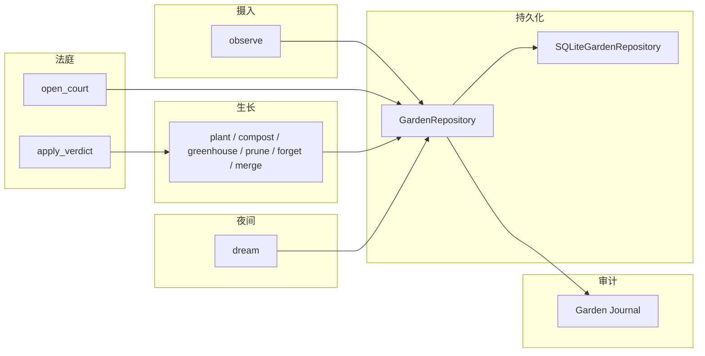

# Garden Life Core 架构说明

本文描述 Memory Garden **v0.1 第一层**：Garden Life Core。它是本地优先的记忆**生命周期内核**，不是完整应用，也不包含上层 Agent 运行时与采摘编排。

---

## 1. 这一层解决什么问题

第一层要解决的不是「增删改查一段文本」式的通用 memory CRUD，而是把「候选 → 裁决 → 生长 → 夜间整理 → 审计日志 → 持久化」落成**可枚举的领域对象与明确动作**，全部默认落在本地存储上。

用户表达先以 **Seed** 进入系统；是否长成长期记忆由 **法庭规则与判决** 把关；具体写入、合并、堆肥、温室、修剪、遗忘等由 **Growth** 执行；**Dream** 在规则层面对候选种子与非温室记忆做批量整理；**Garden Journal** 记录关键事件以便复盘与调试。

---

## 2. 这一层不解决什么问题

以下能力**明确不在本层范围**（可能在后续层出现，也可能永远不放进内核）：

| 不包含 |
|--------|
| CLI / Web UI |
| Agent Runtime（会话编排、工具调用循环等） |
| Harvester（面向回答前的记忆采摘与排序） |
| Garden Brief（摘要与汇报产物） |
| 默认 LLM 调用或 LLM fallback |
| 向量检索、语义搜索、embedding、rerank |
| 云同步、多租户、多用户 SaaS |

读者不应把本仓库第一层误认为「即插即用的记忆云服务」或「带 UI 的产品」。

---

## 3. 生命周期总览

数据与控制流的主路径如下：**Seed** 经观察写入仓储 → **Memory Court** 开庭并产出判决（CourtCase）→ **Growth Actions** 按判决或门面编排执行 → **Dream Cycle** 周期性整理种子与记忆卡 → 全过程写入 **Garden Journal**，实体落在 **SQLite**（经 GardenRepository 抽象）。



说明：`apply_verdict` 只在门面层把判决映射到具体 Growth 调用；法庭引擎本身**不**执行种植或堆肥。

---

## 4. 核心对象

- **Seed**：从对话文本抽取的候选记忆单元，带信号类型、标签、置信度与状态；未经法庭与生长动作，不应等同于长期记忆。
- **MemoryCard**：判决通过后落地的长期记忆卡片，含语义字段（标题、本质、香棘等隐喻字段）、生命周期、溯源 id（种子、案件、梦境记录等）。
- **CourtCase**：围绕某颗种子的庭审记录，内含控辩与隐私守卫陈述及**结构化判决**。
- **CourtVerdict**：判决类型（如 plant / compost / hold 等）、理由、置信度、可选 `target_memory_id`（用于合并、修剪、温室等需指向已有卡片的情形）。
- **CompostRecord**：堆肥记录——丢弃表层叙述与保留「养分」说明，对应负面或不宜固化为身份的内容路径。
- **GreenhouseRecord**：记忆进入温室隔离的策略说明；卡片生命周期与会配合进入 greenhouse。
- **PruningRecord**：修剪（如生命周期迁至 PRUNED）的可解释记录。
- **DreamRecord**：规则版梦境周期的结构化输出（观察、反思、变换描述、晨园快照及各列表 id），用于追溯夜间整理做了什么。
- **GardenEvent**： append-only 风格的领域事件，便于列表查询与审计，不替代业务实体。

---

## 5. 核心流程

以下均为第一层已有入口或其直接委托；语义细节以代码与测试为准。

- **observe**：调用 SeedObserver，从文本生成并持久化 Seed（及 seed_created 类事件）。**不会**自动开庭或种植。
- **open_court**：对候选种子调用法庭引擎 `open_case`，写入 CourtCase 与相关日志。**默认**仅处理 pending 种子（避免重复开庭的具体策略见门面实现）。**不执行**判决对应的生长动作。
- **apply_verdict**：根据已有 CourtCase 中的判决类型，委托对应的 Growth（如对 PLANT 调用 plant）。HOLD 等不触发生长的判决由门面约定种子状态（例如 held），且不写入新 MemoryCard。
- **plant**：在判决允许的前提下，将种子写成 MemoryCard 并更新种子状态。
- **compost**：种子堆肥路径，写入 CompostRecord，依赖法庭与策略校验（例如判决须匹配 compost 等）。
- **greenhouse**：将指定 MemoryCard 转入温室生命周期并写入 GreenhouseRecord。
- **prune**：将记忆卡标为修剪状态并写 PruningRecord。
- **forget**：软/硬遗忘；硬遗忘删除 MemoryCard 行，语义边界见第 7 节。
- **merge**：种子并入已有卡片，或卡片并入卡片，合并溯源与文本线索，由既有 Growth 实现。
- **dream**：委托 DreamCycleEngine，对仓储中的种子与非温室记忆做规则聚类、堆肥、合并等；**不**自动开庭，也**不是**调度器。
- **recent_events**：通过 GardenJournal 读取已持久化的事件列表。

MemoryGardenCore 门面负责组装 Repository、Journal、Observer、Court、Dream 等，并把常用动作暴露为较薄的 API；**不在门面内重写**法庭或梦境的内部规则。

---

## 6. 本地持久化设计

- **GardenRepository**：抽象接口，按实体类型划分 save/get/list/update 等方法，业务层只依赖接口而非具体数据库。
- **SQLiteGardenRepository**：当前唯一完整实现；连接可由调用方传入路径，门面默认使用 `:memory:` 时不落盘用户目录。
- **存储形态**：各表以 JSON 序列化 **Pydantic 模型** payload，便于 schema 演进与 round-trip 校验。
- **为何未引入 SQLAlchemy ORM**：第一层实体数量可控，显式表结构与 JSON payload 足够清晰；减少依赖面（运行时核心依赖目前仅为 Pydantic），便于审计与小体量部署。

---

## 7. 边界与安全语义

- **observe 不会直接 plant**：观察只负责候选种子落库与事件，长成记忆卡必须经法庭判决与生长路径。
- **Court 只判决不执行**：`open_case` 产生判决与状态变更（如种子进入 in_court），但不调用 plant/compost 等；执行在 `apply_verdict` 或显式 Growth API。
- **greenhouse 默认隔离**：语义上敏感或需隔离的记忆进入温室；列表 API 默认可排除温室卡片（由 Repository 约定）。
- **hard forget 当前只硬删除 MemoryCard 本体**：不会自动级联删除 Seed、CourtCase、GardenEvent 等；这是现有契约下的刻意范围；「全链路遗忘」若需要，须另行设计，不在第一层假装完成。
- **no LLM fallback**：第一层不包含默认大模型补全或裁决。
- **无向量检索与搜索能力**：`list_memories` 等为仓储列表与过滤，不是语义检索产品。

---

## 8. 当前测试覆盖

全量测试（截至文档编写时的基线）：

```bash
python -m pytest tests -q
# 144 passed
```

测试覆盖模型、仓储契约、SQLite、日志、种子生命周期、法庭、堆肥、温室、修剪、梦境周期、MemoryGardenCore 门面等；**不**代表上层 Runtime 或 Harvester 已存在。

---

## 9. 当前限制

- 法庭与梦境均为**规则版启发式**，易误判边界案例，不宜当作司法级或临床级判断。
- **无 Harvester**：没有任何「回答前自动选记忆」的策略；列表不等于采摘顺序。
- **无 Garden Brief**：不产出面向用户或上层的简报流水线。
- **无全链路 hard forget**：见第 7 节。
- **无 UI / CLI**：第一层不提供终端或网页产品壳。

---

## 10. 下一层预期

后续可以在此之上接入 **Runtime**（会话与工具编排）、**Harvester**（采摘与排序）、**Garden Brief**（汇报与压缩）等；但 **Garden Life Core 第一层建议保持冻结**：仅在有明确语义 bug 或契约修正时改动内核，避免把上层需求摊进领域模型与仓储接口。

---

*文档版本：与 Memory Garden v0.1 第一层实现对齐；若实现变更，请同步更新本文。*
