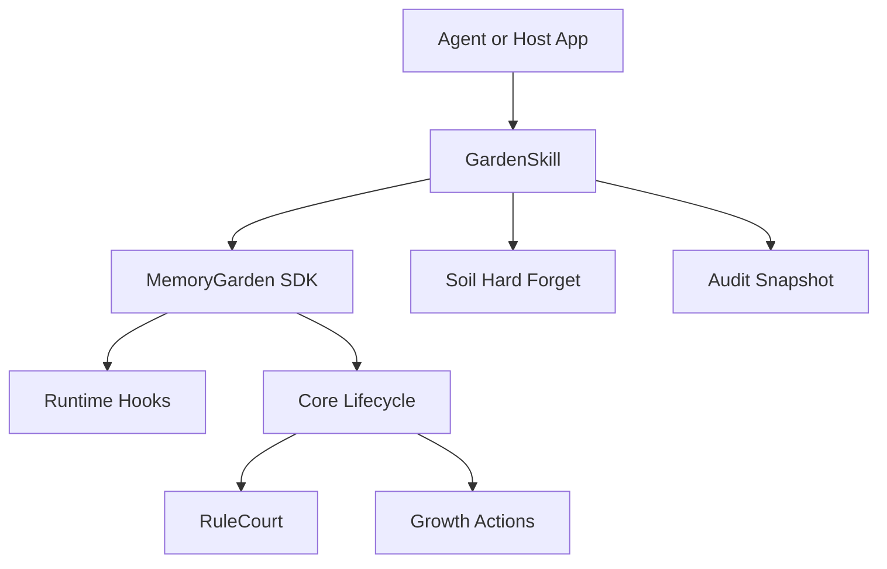

# Skill Layer

The Skill layer is the product-facing adapter over Memory Garden. It does not
replace Core, Court, Soil, Harvest, or Cognition. It constrains them behind a
stable agent-facing contract.

## Responsibilities

- Session open/close wrappers.
- Framework-agnostic before/after hooks.
- Court-mediated remember operations.
- Soil-backed hard forget operations.
- Rule-only local harvest for agent context.
- Health, summary, and audit snapshots.
- Stable result and error models.

## Non-Responsibilities

- No default network provider.
- No active LLM Court.
- No direct mutation that bypasses RuleCourt for remembering.
- No automatic Dream merge/prune/protect.
- No storage engine abstraction beyond the SDK garden home.

## Boundary

Remembering flows through `Core.observe()` and `Core.open_court()`. In court
write mode, only the resulting rule verdict is applied. Forgetting is separate
and delegates to Soil hard forget, never provider advice.

## Stable Models

- `SkillConfig`
- `SkillOperationResult`
- `SkillHarvestResult`
- `SkillAuditView`
- `SkillError`

These models are serializable and suitable for contract tests and future replay
analysis.
